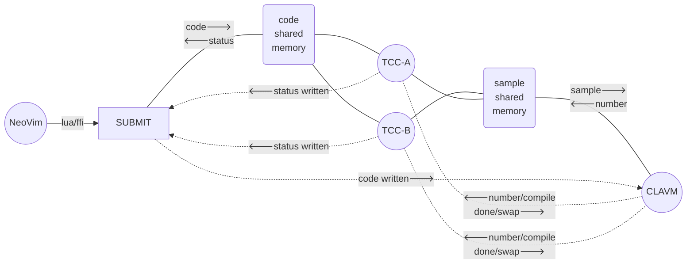

Change Keyboard latency settings on macOS

    defaults write -g InitialKeyRepeat -int 10 # normal minimum is 15 (225 ms)
    defaults write -g KeyRepeat -int 1 # normal minimum is 2 (30 ms)

Measure TCP setup latency on localhost:

    socat TCP-LISTEN:8001,fork -
    pip3 install tcp-latency
    tcp-latency -p 8001 localhost

2023-11-06..

The CLAVM API:

On the user code side, we have C as implemented by TinyCC. There are several functions that we can expect:

- For controlling execution:
  * `void play(void)` ~ called at the sample rate
  * `void compiled(void)` ~ called after the code is compiled
- For accessing state memory:
  * `float* _float(int)`
  * `double* _double(int)`
  * `int* _int(int)`
- For input/output and parameters
  * `void _out(int,float)` ~ output the given float on the given channel
  * `float _in(int)` ~ return the float on a given channel
  * `float _cc(int)` or `float _p(int)` and `int _i(int)`
- For other things
  * `double _time(void)` ~ second since the audio server started
  * `double _samplerate(void)` ~ the current sample rate
- What else? Perhaps a set of builtins, a library that might include...
  * `float Phasor(float)`
  * `float Cycle(float)`
  * `float Tri(float)`
  * `float Pulse(float,float)`
  * `float Onepole(float,float)`
  * `float History(float)`
  * `float Delay(float,float)`
  * `float Dust(float)`
  * `float Uniform(float)`
  * `float Normal(float)`

On the back end, we have C++ and C as implemented by clang (MSVC on Windows). The functions above are implemented on this backend in the C (flat) namespace---That is to say *no* namespace. Most of these functions depend on a single contiguous block of memory to operate. This memory should be shared etween the two compiler processes.

Idea: get rid of OSC. The bridge from Vim (Neovim) to the audio server is OSC, implemented in the luajit that is built into Neovim. What if, instead of OSC, we could use a shared memory interface to pass the text from the vim buffer to the audio server? I think this would be some C + FFI where the lua calls an FFI function `string send(string)` that connects to the shared memory, copies the string in, and posts the semaphore that signals the write is done.

submit.c (knows how to send clavm a string and get back a string)
clavm.cpp (server to Neovim, client to TCC processes)
server.cpp (pair of TCC processes that share memory)

submit might need to be a shared library so that lua can do FFI.

# CLAVM system diagram

- Circles are long-lived processes
- Rectangles are short-lived processes
- Soft rectangles are memory-mapped shared memory
- Solid lines are memory-mapped shared memory access
- Dashed lines are semaphores
- SUBMIT's wait on "status written" has a timeout
  - ...indicates that...
    1. The system is too slow **or**
    2. CLAVM or TCC is crashed or deadlocked
  - Restart the system or do nothing or ???
- CLAVM's wait on TCC *compile* semaphores has a timeout
  - ...indicates that...
    1. The compile is too slow
    2. TCC is crashed or deadlocked
  - Restart TCC; Or, Restart CLAVM
  - Less likely than an *execute* timeout
- CLAVM's wait on TCC *execute* semaphores has a timeout
  - ...indicates that...
    1. The *execution* is too slow
    2. Code has an infinite loop
  - Restart TCC; Or, restart CLAVM; Or, 
    - Swap back to executing the TCC instance we were using before
  - More likely than a *compile* timeout

## We want to know:

- How long does `posix_spawn` take to spin up a TCC instance?
- When a TCC crashes, does restarting it work? Or, do both instances need to restart?

## Warnings

- Here be dragons
- Absolutely do not use this software; Don't do it
- The nuclear reactor operates without containment
- CLAVM is **physically dangerous**
  - It is very likely you will accidentally make terrible, extremely loud sounds that will hurt your ears.
- CLAVM can do anything to your computer. It can run dangerous commands: `rm -rf ~`
- CLAVM is a security nightmare. It has full access to your files and your internet connection.

## Rules for using CLAVM:

1. Do **not**:
   * use CLAVM (You really should not be doing this)
   * expect CLAVM to be safe and easy
   * use `static` variables
   * use global variables
   * allocate heap memory (no `malloc`)
   * call `system` (e.g., `system("rm -rf ~")`)
   * use code that you did not write yourself
2. Best not:
   * `#include` files (possible, but slows compiling)
   * make code huge (slows compiling)
   * use `printf` or other i/o (slows execution ~ dropped audio frames)
   * make syscalls
   * make infinite loops
3. Do:
   * use designated memory (e.g., `_float(int)`)
   * use stack memory
   * use `#define` and macros
   * start stateful functions with a capital letter (e.g., `Phasor(float)`)
4. Try:
   * to have fun
   * to invent new styles of live coding
   * to learn vim

This is the last thing I worked on (2023-11-05).

I got memory-mapped shared memory between processes and learned about OS semaphores to signal between processes. deadlocks are a problem. I must think carefully about how the parts interact.

this shared memory strategy could be useful for hotswapping TCC as well. Two processes, each with a TCC instance, share memory: the state of the audio calculations. A third process spawns the pair and manages swapping between them, one acting as a compiler and the other calculating samples.

One takes over where the other left off because they share a memory.

This might get rid of the mysterious "relocate failed" problem in the current hotswap compiler implementation

complicated!

If one crashes, do we restart them both? Or, just the one that crashed? How do we distribute parameter data such as that from MIDI or OSC?

The audio server process just needs to keep the pair of processes alive.

IT will also have to manage the swapping between the two processes.

In the user code, globals and static variables will be broken because they will not be synchronized. the only shared memory is the explicitly shared memory. That's ok. globals and statics are generally frowned upon.

the file "client.cpp" now holds my latest work. i was having trouble with:

- if the server starts before the client, the semaphore opens fails
  * fix was just creating the semaphores on the server as well as the client; no harm
- if the client starts before the server, then the client gives up because the server is not responding
  * fix was replacing the shell out (calling system()) with a call to fork which i assume is much faster than shelling out

it looks like posix_spawn is faster than fork. 

    https://stackoverflow.com/questions/2731531/faster-forking-of-large-processes-on-linux

at this point, submit.cpp and clavm.cpp communicate in the right way

on setting up Perfetto and building the tracing daemon

<https://perfetto.dev/docs/quickstart/linux-tracing>
